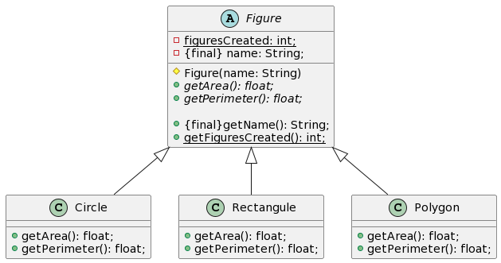

#Diagrama Adjunto

#Código de Plantuml
```
abstract class Figure{

-{static} figuresCreated: int;
-{final} name: String;

#Figure(name: String)
+{abstract}getArea(): float;
+{abstract}getPerimeter(): float;

+{final}getName(): String;
+{static}getFiguresCreated(): int;

}

class Circle extends Figure{
+getArea(): float;
+getPerimeter(): float;
}

class Rectangule extends Figure{
+getArea(): float;
+getPerimeter(): float;
}

class Polygon extends Figure{
+getArea(): float;
+getPerimeter(): float;
}```